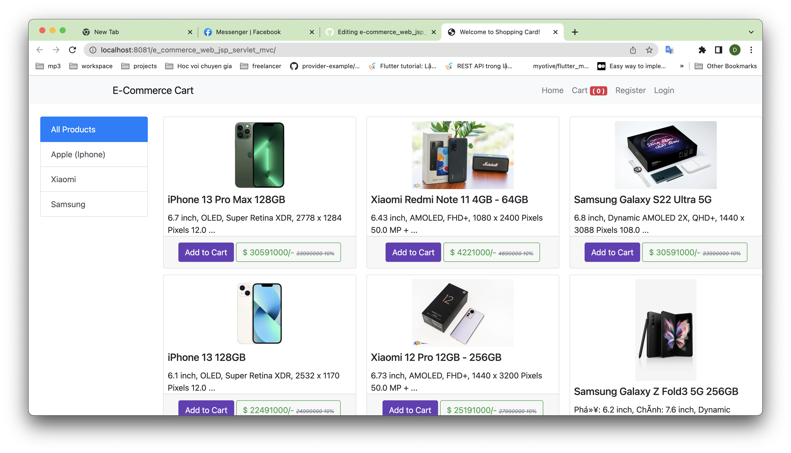
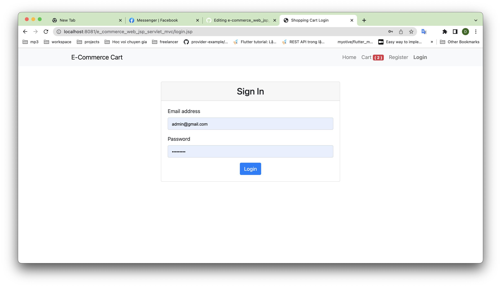
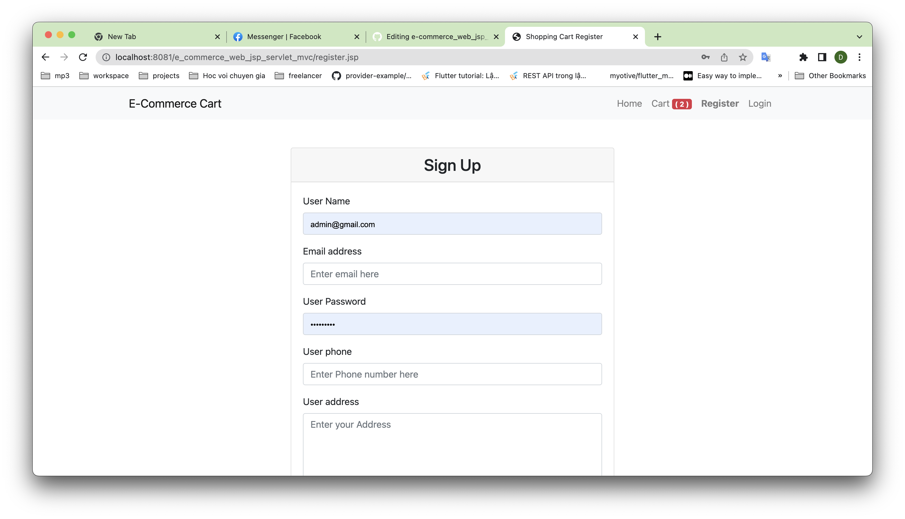
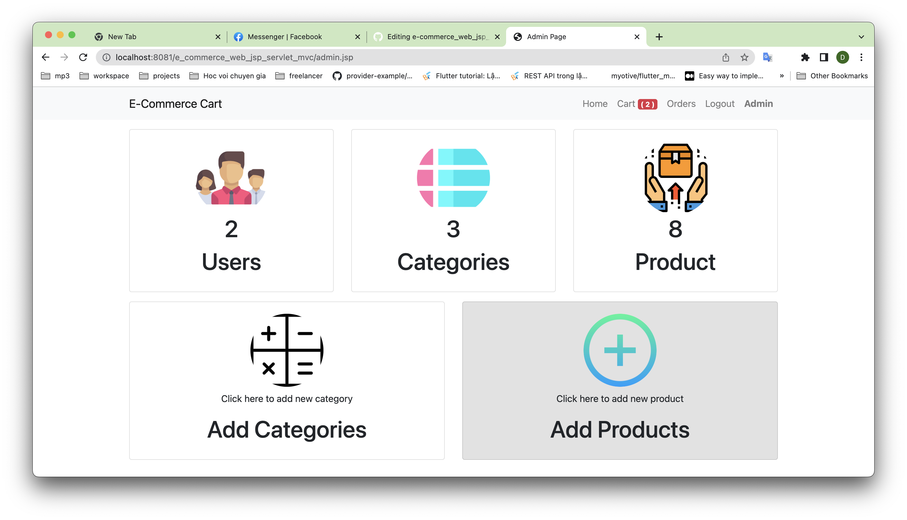
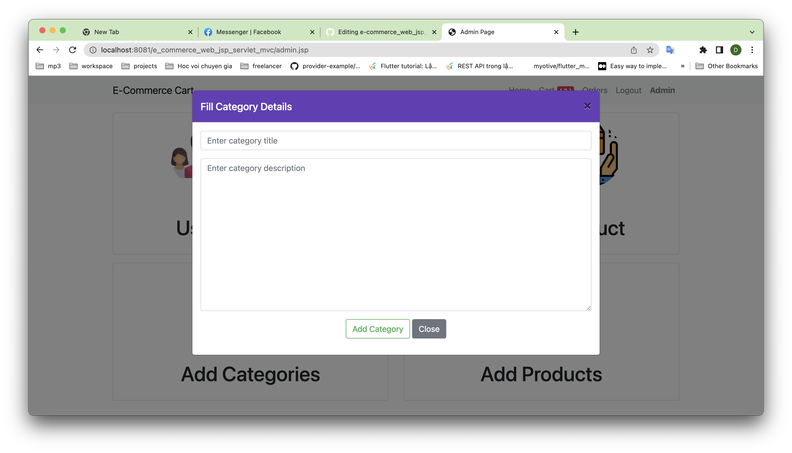
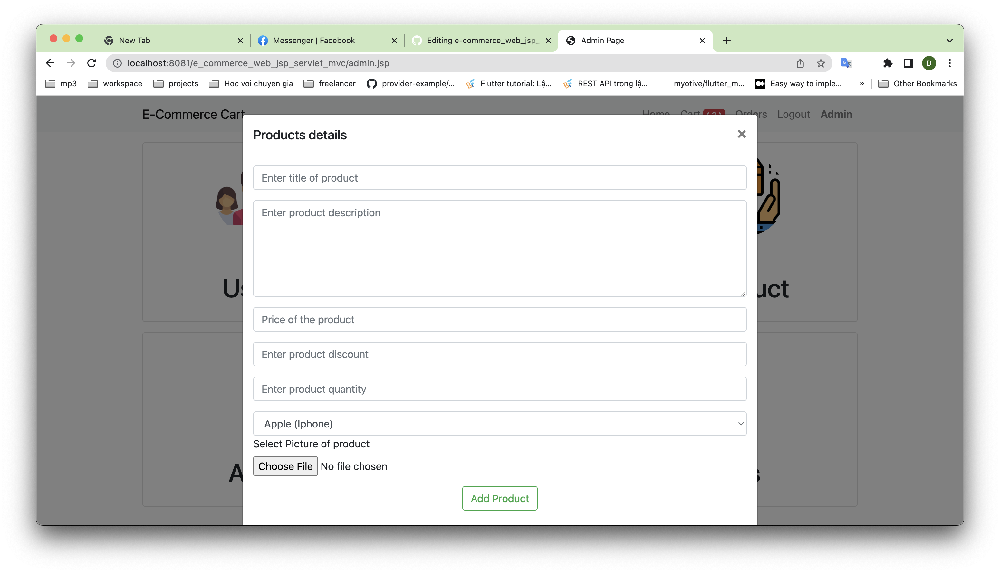
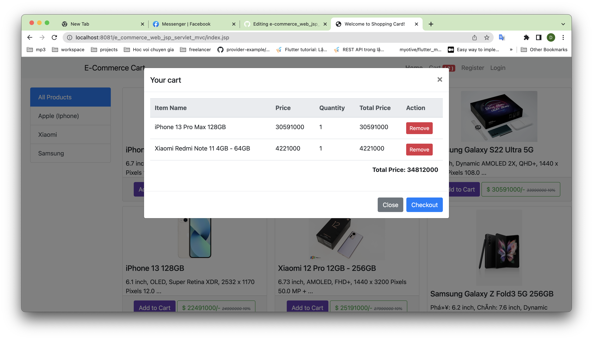
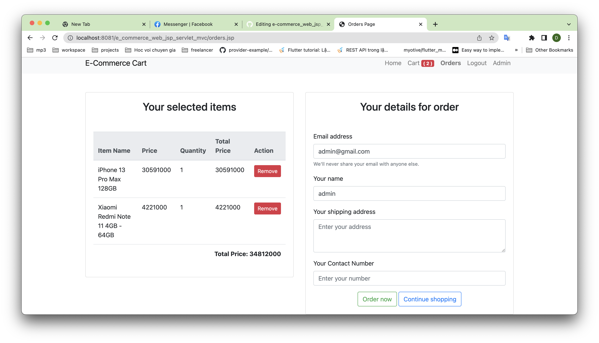

# E-commerce Website Using Kotlin
### E-commerce
**This Website is built for following purpose:-**
- For buying product online
- Maintaining sale history
- Adding and managing products
- User Friendly
- For Implemention of Generic Servlets in Kotlin
- This is a Mini-project developed using Kotlin, Jdbc, Bootstrap.

**Admin Have Following Access for this E-Commerce website:-**
- Add New Products
- Add New Category
- View Available Products
- View Current Users
- View Category
- Remove Products

**Users Have Following Access for this E-Commerce website:-**
- Create New Account or Register
- Login
- View Available Products
- Select Product to Buy
- Select Product Quantity
- Add To cart
- Go to Checkout Page

### MVC Pattern:

### Technologies used:
1. Front-End Development:
- Html
- Css
- Javascript
- Bootstrap 4

2. Back-End Development
- Kotlin
- JDBC
- Servlet
- Gradle Support

3. Database used
- Sql/MySql

Note:- This is a basic Project, so we have not thought about the security, and we have only implemented this project using the generic servlet

#### "Suggestions and project Improvements are Invited!"

<bold>Thanks a lot</bold> 
Project Creator 
<b>Duynn</b>

<h1>This is Home Page</h1>

<h1>This is Login Page</h1>

<h1>This is Register Page</h1>

<h1>This is admin Page</h1>

<h1>This is Add Category Modal</h1>

<h1>This is Add Product Modal</h1>

<h1>This is Card Modal</h1>

<h1>This is Checkout Page</h1>

